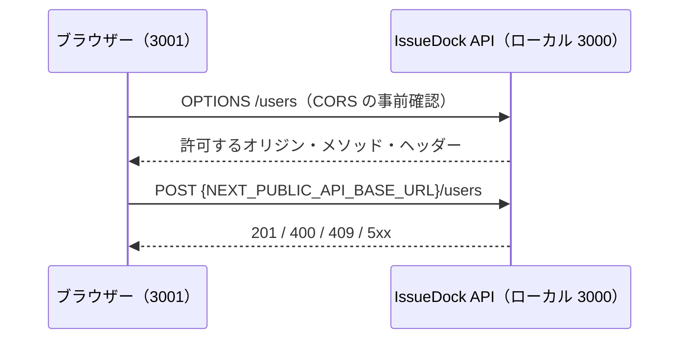

# サインアップ画面の実装設計

[画面仕様](signup-specification.md)の実装構成と導入方針を記録する。Web リポジトリは Next.js 16.3.5、React 19.2.8、Tailwind CSS 4 を使用する。サインアップ画面と、ここに記す依存関係・環境変数は実装済み。

## 採用するもの

| 用途 | 採用 | 理由 |
| --- | --- | --- |
| フォーム状態 | React Hook Form | 4 項目の値、検証、送信中の状態をまとめて扱える。React 19 で利用可能。 |
| 検証 | Zod と `@hookform/resolvers` | 画面の検証規則と型をスキーマで管理できる。導入時は互換する最新版の組み合わせを確認する。バックエンドでも独立して再検証する。 |
| UI | shadcn/ui の必要なコンポーネントのみ | 既存の Tailwind CSS を使い、Input、Button、Field などをプロジェクト内で管理できる。追加されたコードは必要に応じて修正できる。 |
| HTTP | Web 標準の `fetch` | 登録の 1 リクエストには専用の HTTP ライブラリを増やす利点が小さい。共通の API 呼び出し層が必要になった段階で再検討する。 |

今回の画面には一覧キャッシュや再取得がないため、TanStack Query は導入しない。`axios` も追加しない。これらの判断は現在の 1 画面の範囲に対するもの。

## リクエスト経路



ブラウザーからバックエンドを直接呼ぶ。登録画面は `NEXT_PUBLIC_API_BASE_URL` を読み取り、URL の末尾スラッシュの有無を正規化して `/users` を組み立てる。`Content-Type: application/json` のクロスオリジン POST は事前確認（OPTIONS）を伴うため、バックエンドの CORS 設定が必要になる。送信中は重複送信を防ぎ、通信失敗と HTTP ステータスを区別して扱う。

`passwordConfirmation` はブラウザー内での一致確認だけに使い、バックエンドには送らない。成功時の API は本文なしなので、無条件に `response.json()` を呼ばない。フロントエンドの検証は入力補助であり、バックエンドの検証を省略しない。

### バックエンドの CORS 設定

隣の `issue-dock-api/src/main.ts` では `app.enableCors({ origin: 'http://localhost:3001' })` が設定されており、ローカルの許可元は対応済み。本番の `https://issue-dock.com` は、フロントエンドのデプロイ完了後に許可元へ追加する予定。現状の設定だけでは本番画面からの直接呼び出しは成功しないため、本番で登録フローを公開する前に API 側の設定とデプロイを完了する。`POST` と `Content-Type` を含む事前確認への応答も確認する。許可元は環境ごとに設定し、無条件の全許可は避ける。サインアップの現行 API は Cookie 認証を使わないため、認証情報付き CORS はこの画面に不要。将来ログインを Cookie 方式にする場合は、Cookie 属性、`credentials`、CORS の認証情報設定をまとめて設計する。

## ファイル配置

```text
src/app/signup/page.tsx          /signup のタイトルとフォーム配置
src/app/signup/signup-form.tsx   Client Component、入力・エラー・送信状態
src/lib/signup-schema.ts         検証規則と型
src/components/ui/              画面で使う shadcn/ui コンポーネント
```

`page.tsx` は Server Component のままにし、対話部分だけを Client Component にする。フォームには `type="email"`、`autoComplete="email"`、`autoComplete="username"`、`autoComplete="new-password"`、適切なラベルと `aria-invalid`、エラー文への `aria-describedby` を設定する。エラーは初回送信時に全件表示し、その後は修正時に更新する。送信結果は `aria-live` 領域で通知する。

## 環境変数とポート

`package.json` の `dev` は `next dev --port 3001` に設定済み。本番起動用の `start` は `next start` のままにして、ホスティング環境の `PORT` を受け付ける。ローカルで本番ビルドを確認するときは `npm run start -- --port 3001` を使用する。

ローカルでは `.env.example` をプロジェクトルートの `.env.local` にコピーする。

```dotenv
NEXT_PUBLIC_API_BASE_URL=http://localhost:3000
```

現行 API を使う本番ビルド環境には以下を設定する。

```dotenv
NEXT_PUBLIC_API_BASE_URL=https://issue-dock-api-822574234164.asia-northeast1.run.app
```

独自ドメインへの移行後は、ビルド時の値を `https://api.issue-dock.com` に変更する。`.env.local` は Git 管理しない。`NEXT_PUBLIC_` の付いた値はブラウザーに公開され、Next.js のビルド時に固定されるため、接続先を変える場合は再ビルドが必要。環境変数が未設定または不正な場合に別環境へ黙って接続せず、設定エラーとして検出する。

## 実装時の確認

1. `npm run lint` と `npm run build` が通ることを確認する。
2. 正常入力、各境界値、確認欄不一致を画面で確認する。メールは正規表現の境界と API の `z.email()` との差も確認する。
3. API の 201、400、409、5xx、接続不能を模擬し、画面に適切な結果が出ることを確認する。
4. API を 3000、Web を 3001 で起動し、OPTIONS と POST が CORS により許可されて実際に登録できることを確認する。本番でも `https://issue-dock.com` からの事前確認と POST を確認する。

## 参照資料

- このリポジトリの `node_modules/next/dist/docs/01-app/02-guides/` にある `environment-variables.md`、`forms.md`
- このリポジトリの `node_modules/next/dist/docs/01-app/03-api-reference/06-cli/next.md`
- [NestJS: CORS](https://docs.nestjs.com/security/cors)
- [MDN: CORS](https://developer.mozilla.org/en-US/docs/Web/HTTP/Guides/CORS)
- [shadcn/ui: React Hook Form](https://ui.shadcn.com/docs/forms/react-hook-form)
- [shadcn/ui: Next.js への導入](https://ui.shadcn.com/docs/installation/next)
- [React Hook Form のリゾルバー](https://github.com/react-hook-form/resolvers)
